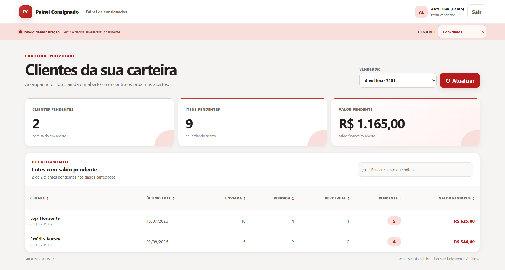

<div align="center">

# Consignment Batch Management System

**Public portfolio demo for tracking consignment batches, settlements, returns, pending balances, and customer portfolios.**

<p>
  <a href="https://github.com/leviroiz/gestao-lotes-consignados-demo/actions/workflows/quality.yml">
    
  </a>
  <a href="https://github.com/leviroiz/gestao-lotes-consignados-demo/actions/workflows/pages.yml">
    
  </a>
  <a href="https://leviroiz.github.io/gestao-lotes-consignados-demo/">
    
  </a>
  <a href="LICENSE">
    
  </a>
</p>

### 🌐 [Open the live demo](https://leviroiz.github.io/gestao-lotes-consignados-demo/)

</div>

---

## 🚀 Overview

This project was created from the analysis of a real consignment workflow involving batches, customers, sellers, settlements, returns, and pending balances.

The goal was to transform fragmented operational information into a clearer interface capable of answering questions such as:

- Which customers still have pending balances?
- How many items were shipped, sold, returned, or remain pending?
- Which sellers still have open settlements?
- Which customer portfolios require attention?
- How can this information be consolidated for administrative monitoring?

> [!IMPORTANT]
> **This repository contains a sanitized public demo, not the original operational system.**
>
> All data, customers, sellers, scenarios, and interface content used in this version are synthetic.

---

## 🖥️ Demo Preview

<p align="center">
  
</p>

The public demo presents a seller-focused view with portfolio indicators, pending balances, customer search, sorting, and detailed consignment status.

All information shown in the interface is synthetic and exists only for demonstration purposes.

---

## ✨ Key Features

### 👨‍💼 Administrative View

- consolidated operational indicators
- seller portfolio comparison
- customer search
- combined filters
- sorting
- pending quantity and value tracking
- visibility across multiple seller portfolios

### 🧑‍💼 Seller View

- individual customer portfolio
- open consignment batches
- pending quantities
- pending values
- upcoming settlement visibility

### 🔎 Data Exploration

- customer search
- seller filters
- period filters
- quantity and value filters
- configurable sorting
- shipped, sold, returned, and pending quantities
- responsive interface

### 🧪 UI States

The demo also includes:

- loading state
- empty-results state
- simulated failure state
- manual refresh
- interface adaptation based on the selected user profile

---

## 🧩 Public Demo vs. Original Prototype

The public repository intentionally differs from the prototype originally explored during the project.

| Original prototype | Public portfolio demo |
|---|---|
| Full-stack architecture | Static web application |
| Backend and API | No backend |
| Data persistence | Synthetic JavaScript data |
| Authentication and authorization | Locally simulated profiles |
| ERP integration concepts | No external integrations |
| Server-side business rules | Browser-side demo logic |
| Operational environment | GitHub Pages |

### Original prototype concepts

The original study explored technologies and concepts including:

`Python` · `FastAPI` · `Jinja2` · `SQLite` · `HTTPX` · `REST APIs` · `Pytest`

It also explored:

- authentication
- role-based authorization
- session management
- data persistence
- business rules
- ERP/API integration architecture
- automated testing

> These components belong to the original prototype and are **not included in the public repository**.

---

## 🏗️ Architecture

### Original Concept

```text
User
  │
  ▼
Web Interface
  │
  ▼
Jinja2 + HTML + CSS + JavaScript
  │
  ▼
FastAPI
  │
  ▼
Business Rules
  │
  ▼
SQLite
  │
  ▼
Integration Layer
  │
  ▼
ERP / REST API
```

### Public Demo

```text
Synthetic JavaScript Data
          │
          ▼
Filtering & Aggregation Rules
          │
          ▼
Local Profile Control
          │
          ▼
DOM Manipulation
          │
          ▼
Responsive Interface
```

The public demo runs entirely in the browser and does not use a backend, database, authentication service, cookies, `localStorage`, private endpoints, or ERP integrations.

---

## 🛠️ Public Demo Stack

<p>
  
  
  
  
  
</p>

The public version uses:

- semantic HTML
- responsive CSS
- vanilla JavaScript
- native DOM APIs
- `Intl.NumberFormat`
- browser-side filtering and sorting
- GitHub Actions
- automatic GitHub Pages deployment

---

## 🧠 Product Decision

During the project, the analysis revealed that the company already had an internal feature capable of addressing a significant part of the operational problem.

Instead of introducing a new system only because a prototype had already been developed, the operational decision was to adopt and structure the existing solution with the team.

The prototype therefore fulfilled its role in:

```text
Operational Problem
        │
        ▼
Process Analysis
        │
        ▼
Requirements
        │
        ▼
Business Rules
        │
        ▼
Solution Proposal
        │
        ▼
Prototype
        │
        ▼
Validation
        │
        ▼
Product Decision
```

This project is intentionally **not presented as a production deployment**.

Sometimes the best software decision is not to introduce another application.

---

## 🧪 Quality & CI

The repository includes automated checks executed through GitHub Actions.

The quality workflow validates:

- JavaScript syntax
- basic `index.html` structure
- potentially sensitive files
- database and certificate file extensions
- `.env` files
- private keys
- common API key patterns
- client secrets
- bearer tokens
- accidental network calls

```text
Push / Pull Request
        │
        ▼
GitHub Actions
        │
        ├── JavaScript Validation
        ├── Public Demo Audit
        └── Sensitive Content Checks
                    │
                    ▼
              Pass / Block
```

Deployment to GitHub Pages is handled by a separate workflow.

---

## 🔒 Security & Privacy

The public demo was prepared specifically to avoid exposing information from the original operation.

It contains:

- only synthetic data
- no real company brands or names
- no credentials
- no databases
- no internal endpoints
- no corporate integrations
- no visitor data collection

Dynamic content is rendered using safe DOM APIs such as `textContent`.

> [!NOTE]
> This demo does not represent a production security architecture.
>
> Real authentication, server-side authorization, secure persistence, encryption, and abuse protection would require a backend and a dedicated security design.

For additional details, see [SECURITY.md](SECURITY.md).

---

## ▶️ Running Locally

The public demo has no external runtime dependencies.

Clone the repository:

```bash
git clone https://github.com/leviroiz/gestao-lotes-consignados-demo.git
cd gestao-lotes-consignados-demo
```

Then open:

```text
index.html
```

in your browser.

You can also use the hosted version:

### 🌐 [Live Demo](https://leviroiz.github.io/gestao-lotes-consignados-demo/)

---

## 📁 Repository Structure

```text
gestao-lotes-consignados-demo/
├── .github/
│   └── workflows/
├── assets/
│   ├── app.js
│   └── styles.css
├── scripts/
│   └── audit_public_demo.py
├── index.html
├── README.md
├── SECURITY.md
├── LICENSE
└── .gitignore
```

---

## 📄 License

This project is available under the [MIT License](LICENSE).
